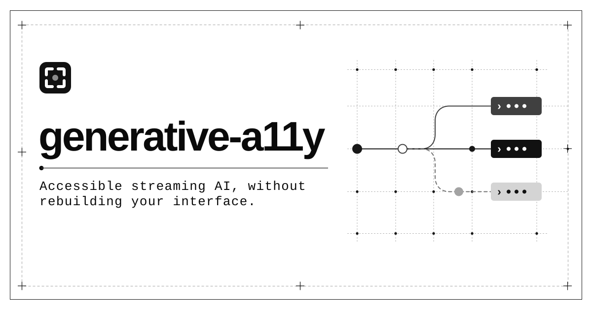

<a href="https://generativea11y.com">
  <picture>
    <source media="(prefers-color-scheme: dark)" srcset=".github/assets/header-dark.svg" />
    <source media="(prefers-color-scheme: light)" srcset=".github/assets/header.svg" />
    
  </picture>
</a>

# generative-a11y

[](https://github.com/bhaveshchow20/generative-a11y/actions/workflows/ci.yml)
[](https://github.com/bhaveshchow20/generative-a11y/actions/workflows/codeql.yml)
[](https://deepwiki.com/bhaveshchow20/generative-a11y)
[](LICENSE)

**Accessible AI, without rebuilding your interface.**

`generative-a11y` is an accessibility runtime for streaming AI and agent
interfaces. It turns response, tool, approval, retry, failure, and connection
events into paced screen-reader announcements without requiring developers to
rebuild their UI.

[Website](https://generativea11y.com) ·
[Docs](https://generativea11y.com/docs/getting-started) ·
[Examples](https://generativea11y.com/examples/lifecycle-lab) ·
[npm](https://www.npmjs.com/org/generative-a11y) · [MIT license](LICENSE)

```sh
npm install @generative-a11y/core @generative-a11y/dom
```

> [!IMPORTANT] This project is in pre-1.0 development. Packages use the
> `@generative-a11y` npm scope. External assistive-technology validation remains
> in progress.

[Core API](packages/core/README.md) · [DOM API](packages/dom/README.md) ·
[React API](packages/react/README.md) · [Architecture](docs/architecture.md) ·
[Events](docs/events.md) · [Accessibility policy](docs/accessibility-policy.md)
· [Framework adapters](docs/framework-adapters.md) ·
[Contributing](CONTRIBUTING.md)

## Contents

- [Packages](#packages)
- [Why generative-a11y?](#why-generative-a11y)
- [How it fits](#how-it-fits)
- [Ecosystem](#ecosystem)
- [Core and DOM example](#core-and-dom-example)
- [Development](#development)
- [Community](#community)

## Use generative-a11y when

Your interface streams responses, runs tools, pauses for approval, retries work,
or reconnects after an interruption. The application reports the lifecycle
events it can confirm; generative-a11y turns those events into paced
announcement intents and browser delivery while your visual UI and focus
behavior stay under application control.

## Packages

Install the package that matches your integration. Package dependencies such as
`@generative-a11y/core` are installed automatically.

| Package                                                                                        | Version                                                                                                                                         | Use it for                                                           | Install                                     |
| ---------------------------------------------------------------------------------------------- | ----------------------------------------------------------------------------------------------------------------------------------------------- | -------------------------------------------------------------------- | ------------------------------------------- |
| [`@generative-a11y/core`](https://www.npmjs.com/package/@generative-a11y/core)                 | [](https://www.npmjs.com/package/@generative-a11y/core)                 | Framework-independent runtime plus deterministic testing helpers     | `npm install @generative-a11y/core`         |
| [`@generative-a11y/dom`](https://www.npmjs.com/package/@generative-a11y/dom)                   | [](https://www.npmjs.com/package/@generative-a11y/dom)                   | DOM announcement delivery, focus, attention, and preference behavior | `npm install @generative-a11y/dom`          |
| [`@generative-a11y/react`](https://www.npmjs.com/package/@generative-a11y/react)               | [](https://www.npmjs.com/package/@generative-a11y/react)               | React provider and hooks for custom React applications               | `npm install @generative-a11y/react`        |
| [`@generative-a11y/ai-sdk`](https://www.npmjs.com/package/@generative-a11y/ai-sdk)             | [](https://www.npmjs.com/package/@generative-a11y/ai-sdk)             | Vercel AI SDK lifecycle translation and React integration            | `npm install @generative-a11y/ai-sdk`       |
| [`@generative-a11y/assistant-ui`](https://www.npmjs.com/package/@generative-a11y/assistant-ui) | [](https://www.npmjs.com/package/@generative-a11y/assistant-ui) | assistant-ui runtime and message-state translation                   | `npm install @generative-a11y/assistant-ui` |
| [`@generative-a11y/ag-ui`](https://www.npmjs.com/package/@generative-a11y/ag-ui)               | [](https://www.npmjs.com/package/@generative-a11y/ag-ui)               | AG-UI protocol lifecycle translation                                 | `npm install @generative-a11y/ag-ui`        |
| [`@generative-a11y/devtools`](https://www.npmjs.com/package/@generative-a11y/devtools)         | [](https://www.npmjs.com/package/@generative-a11y/devtools)         | Bounded redacted diagnostics and an optional browser trace explorer  | `npm install -D @generative-a11y/devtools`  |

## Why generative-a11y?

AI interfaces create accessibility problems that ordinary component libraries do
not solve: responses stream incrementally, tools run for uncertain periods, and
agents can pause for approval or fail mid-task. Sending every token to a live
region is noisy; moving focus on routine status changes is disruptive.

This project provides the orchestration layer between AI lifecycle events and
accessible delivery:

- **Meaningful announcements:** segment streaming text into useful units instead
  of announcing tokens.
- **Agent-aware status:** represent tool progress, approvals, retries,
  connection changes, citations, and terminal states.
- **Predictable behavior:** prioritize, deduplicate, coalesce, and bound queued
  work with injected time for deterministic tests.
- **Framework independence:** keep accessibility policy in the core and make
  adapters translate documented public framework state.
- **Honest fidelity:** declare missing lifecycle evidence instead of guessing,
  and keep automated transcripts distinct from real assistive-technology tests.
- **Inspectable behavior:** use bounded redacted traces and deterministic replay
  to connect source events, runtime decisions, and browser delivery evidence.

## How it fits

```text
AI SDK / AG-UI / assistant-ui / custom application state
                         │
                    thin adapter
                         │
                         ▼
              normalized lifecycle events
                         │
                         ▼
           @generative-a11y/core runtime
        segment · prioritize · dedupe · schedule
                         │
                         ▼
              announcement intents
                         │
                    DOM driver
                         │
                         ▼
              assistive technology
```

The core never touches the DOM and never claims that assistive technology spoke
an announcement. That boundary keeps policy portable and delivery testable in
the environment where it actually runs.

## What it is and what it is not

| generative-a11y is                                       | generative-a11y is not                                   |
| -------------------------------------------------------- | -------------------------------------------------------- |
| An accessibility behavior layer for existing AI UIs      | A chat interface or visual component library             |
| A normalized event model for streaming and agent state   | An agent framework, model SDK, or transport protocol     |
| Policy and scheduling for announcement intents           | A replacement for semantic HTML, keyboard, or focus work |
| Infrastructure designed for adapter and DOM integrations | Proof that a specific screen reader announced content    |

## Ecosystem

| Source                    | Intended integration                                        | Status                                                                                |
| ------------------------- | ----------------------------------------------------------- | ------------------------------------------------------------------------------------- |
| Custom applications       | Dispatch events to core and deliver through the DOM package | Implemented; core/DOM browser fixture complete; manual AT validation pending          |
| Custom React applications | Wrap the existing tree with the provider and hooks          | Implemented; deterministic React checks complete; browser/AT validation pending       |
| [AG-UI][ag-ui]            | Translate protocol events through a thin adapter            | Implemented; deterministic and package checks complete; browser/AT validation pending |
| [AI SDK][ai-sdk]          | Observe documented chat state and lifecycle callbacks       | Implemented; deterministic and package checks complete; browser/AT validation pending |
| [assistant-ui][aui]       | Subscribe to documented runtime and message state           | Implemented; deterministic and package checks complete; browser/AT validation pending |
| [CopilotKit][copilotkit]  | Reuse its public AG-UI agent surface where fidelity allows  | AG-UI guidance; no duplicate adapter package                                          |

[ag-ui]: https://github.com/ag-ui-protocol/ag-ui
[ai-sdk]: https://github.com/vercel/ai
[aui]: https://github.com/assistant-ui/assistant-ui
[copilotkit]: https://github.com/CopilotKit/CopilotKit

## Core and DOM example

Install the framework-independent runtime and browser delivery packages:

```sh
npm install @generative-a11y/core @generative-a11y/dom
```

Then connect the runtime to the DOM without replacing the application's visual
interface:

```ts
import { createGenerativeA11y } from "@generative-a11y/core";
import { connectRuntimeToDOM } from "@generative-a11y/dom";

const runtime = createGenerativeA11y({});
const delivery = connectRuntimeToDOM(runtime);

runtime.dispatch({ type: "response.started", responseId: "response-1" });
runtime.dispatch({
  type: "response.text.delta",
  responseId: "response-1",
  delta: "A complete sentence.",
});
runtime.dispatch({ type: "response.completed", responseId: "response-1" });

delivery.dispose();
runtime.dispose();
```

See [`@generative-a11y/core`](packages/core/README.md) for the runtime contract
and [`@generative-a11y/dom`](packages/dom/README.md) for delivery, attention,
focus, and preference APIs.

## Principles

- Keep your existing UI.
- Announce meaningful units, not tokens.
- Never guess lifecycle events an adapter cannot observe.
- Make timing deterministic and inspectable.
- Treat real screen-reader testing as a requirement for support claims, not as
  something deterministic tests can prove.

## Development

Use the Node.js version in `.nvmrc` and install dependencies from the lockfile:

```sh
corepack enable
pnpm install --frozen-lockfile
pnpm check
pnpm test:browser:install
pnpm test:browser
```

`pnpm check` verifies formatting, linting, types, tests with coverage,
production builds, package metadata, and ESM/CommonJS loading.
`pnpm test:browser` runs the focused accessibility fixture in Chromium, Firefox,
and WebKit with axe scans; it does not claim screen-reader output.

See [CONTRIBUTING.md](CONTRIBUTING.md) before proposing a change. Security
issues should follow the private reporting process in
[SECURITY.md](SECURITY.md).

## Community

- [Request a feature or integration](https://github.com/bhaveshchow20/generative-a11y/issues/new?template=feature_request.yml)
- [Report a bug](https://github.com/bhaveshchow20/generative-a11y/issues/new?template=bug_report.yml)
- [Share an assistive-technology test result](https://github.com/bhaveshchow20/generative-a11y/issues/new?template=assistive_technology_report.yml)
- [Get support](SUPPORT.md)

## Maintainer and citation

[Bhavesh Chowdhury](https://github.com/bhaveshchow20) created and maintains
generative-a11y. Use [CITATION.cff](CITATION.cff) when you cite the project in
research, documentation, or technical reports.

## License

[MIT](LICENSE)
